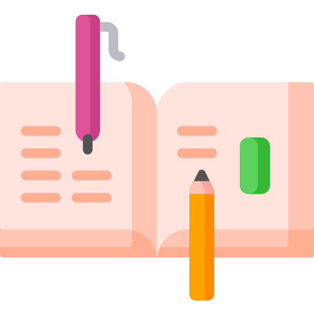

<h1>Проект по курсу PWS. Веб-верстка по макету</h1>


# **Выравнивание на уровне блока**

##  **CSS**
```css
  .wrapper {
    /* box-sizing: border-box; */
    display: inline-block;
    border: 1px solid #777;
    margin: 20px;
    /* padding: 18px; */
    border-radius: 20px;
    overflow: hidden;

    max-width: 40vmin;
    max-height: 40vmin;

    /* height: 50vmax; */
    /* background-color: lightgray; */
  }

  @media screen  and (max-width: 380px) {
    .wrapper {
      display: block;
      max-width: 100vw;
      max-height: 100vmin;
    }
  }
```

##  **HTML**

```html
  <div class="container">
    <div class="wrapper">
      
    </div>
    <div class="wrapper margin-2em">
      
    </div>
  </div>
```

##  Пример Кода

--- 

<iframe 
  src="explore0.html" 
  width="100%" height="600" 
  title="Example Demonstrator"
  style="margin: 10px auto 0;" 
  frameborder="0">
</iframe>

# Содержимое черновика

---

1. Lasr
2. Lost
3. Hesh
- [**Выравнивание на уровне блока**](#выравнивание-на-уровне-блока)
  - [**CSS**](#css)
  - [**HTML**](#html)
  - [Пример Кода](#пример-кода)
- [Содержимое черновика](#содержимое-черновика)
